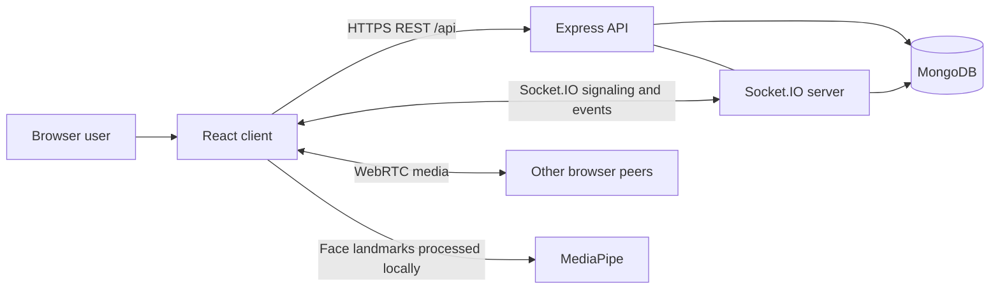

# ThirdEye Client

The browser application for ThirdEye, an online classroom platform with peer-to-peer video, real-time classroom controls, chat, client-side engagement estimation, session analytics, and role-based dashboards.

This repository is the frontend half of ThirdEye. It must be run with the separate `thirdeye-server` repository.

## Features

- Student, instructor, and administrator experiences
- Registration and cookie/token-based sign-in
- Session creation, enrollment, lifecycle management, and invitation links
- Multi-party WebRTC video and screen sharing
- Real-time chat, hand raising, participant state, and instructor media controls
- In-browser MediaPipe facial-landmark processing
- Live engagement indicators and historical charts/heatmaps
- Responsive React UI built with Material UI and Tailwind CSS

## Architecture



REST manages durable application state. Socket.IO carries WebRTC signaling and ephemeral classroom events. Audio and video travel directly between browser peers; they do not pass through the application server. MediaPipe inference also runs in the browser, and selected results are sent to the server for analytics.

See [Architecture](docs/ARCHITECTURE.md) and [Real-time events](docs/REALTIME_EVENTS.md) for the complete flows.

## Requirements

- Node.js 20 or newer (a current LTS release is recommended)
- npm
- A running ThirdEye server and MongoDB database
- A modern browser with WebRTC, WebAssembly, camera, and microphone support
- Internet access at runtime for the MediaPipe WASM runtime and face-landmarker model

## Setup

```bash
git clone <client-repository-url>
cd client
npm install
cp .env.example .env
npm run dev
```

The development app runs at `http://localhost:5173`. Vite proxies `/api` and `/socket.io` to `http://localhost:5000`, so `VITE_SERVER_URL` may be omitted for the standard local setup.

Start the server repository separately before signing in or joining a classroom.

## Environment configuration

| Variable | Required | Description | Example |
| --- | --- | --- | --- |
| `VITE_SERVER_URL` | Production | Public server origin, without `/api` or a trailing slash | `https://api.example.com` |

Vite embeds `VITE_*` values into the browser bundle at build time. Do not put secrets in this file. When the variable is unset, REST uses the same-origin `/api` path and Socket.IO falls back to `http://localhost:5000`.

## Scripts

| Command | Purpose |
| --- | --- |
| `npm run dev` | Start the Vite development server |
| `npm run build` | Type-check and create the production bundle in `dist/` |
| `npm run lint` | Run ESLint |
| `npm run preview` | Serve the built bundle locally for inspection |

## Application routes

| Route | Access | Purpose |
| --- | --- | --- |
| `/login` | Public | Sign in |
| `/register` | Public | Create an account |
| `/join/:roomCode` | Public entry page | Resolve an invitation and continue to the classroom |
| `/dashboard` | Authenticated | Role-specific overview |
| `/sessions` | Authenticated | Browse or manage sessions |
| `/sessions/:sessionId/analytics` | Authenticated | Historical engagement analytics |
| `/classroom/:roomCode` | Authenticated | Full-screen live classroom |
| `/admin` | Authenticated admin | Platform-wide users, sessions, and metrics |

Unknown routes redirect to `/dashboard`. Authorization is ultimately enforced by the server; hiding a client route is not a security boundary.

## Browser permissions and network access

The classroom requests camera and microphone access through `getUserMedia`. Screen sharing uses the browser's `getDisplayMedia` picker and requires a user gesture. Production deployments must use HTTPS for these APIs, except for the browser's `localhost` development exception.

Users should:

- Allow camera and microphone access when prompted.
- Select a screen, window, or tab when starting screen share.
- Allow outbound HTTPS access to `unpkg.com` and `storage.googleapis.com` so MediaPipe assets can load.
- Use a current Chrome, Edge, Firefox, or Safari release.

Peer connections currently use browser WebRTC directly. No TURN configuration is present, so calls can fail on restrictive corporate, campus, carrier-grade NAT, or firewall networks. A production deployment should configure STUN/TURN infrastructure in `src/hooks/useWebRTC.ts`.

Facial landmarks and engagement scores are computed locally. Raw video frames are not uploaded for engagement analysis. The application periodically sends the derived label, score, and face statistics to the API.

## Production deployment

```bash
npm install
VITE_SERVER_URL=https://api.example.com npm run build
```

Deploy the generated `dist/` directory to a static host. Configure an SPA fallback so all paths resolve to `index.html`; `vercel.json` already provides this rewrite for Vercel. The server must allow the deployed client origin through `CLIENT_URL`, support WebSocket upgrades, and use HTTPS.

## Project structure

```text
src/
  api/          Axios client and caching
  components/   Layout, classroom, and analytics UI
  context/      Authentication and toast state
  hooks/        Media, WebRTC, and engagement lifecycles
  lib/          Engagement scoring logic
  pages/        Route-level screens
  socket/       Shared Socket.IO client
  types/        Application contracts
```

## Related documentation

- [System architecture](docs/ARCHITECTURE.md)
- [Socket.IO real-time events](docs/REALTIME_EVENTS.md)
- The server's non-production Swagger UI: `http://localhost:5000/api/docs`
