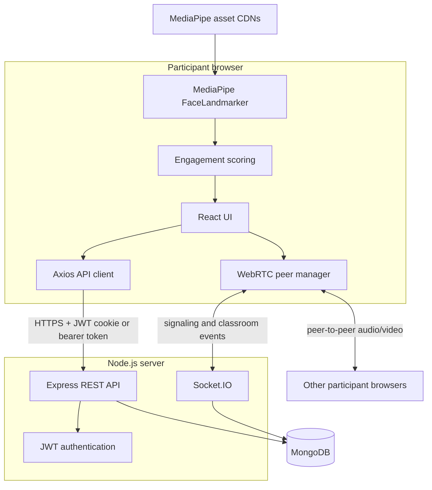
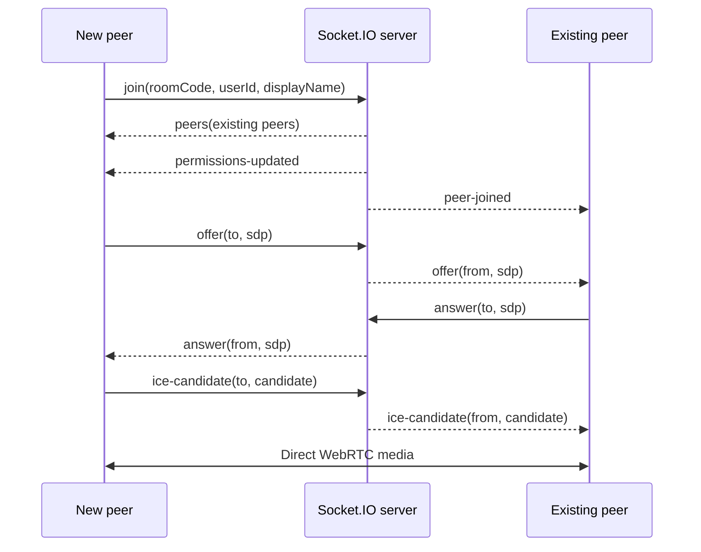
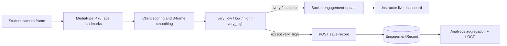
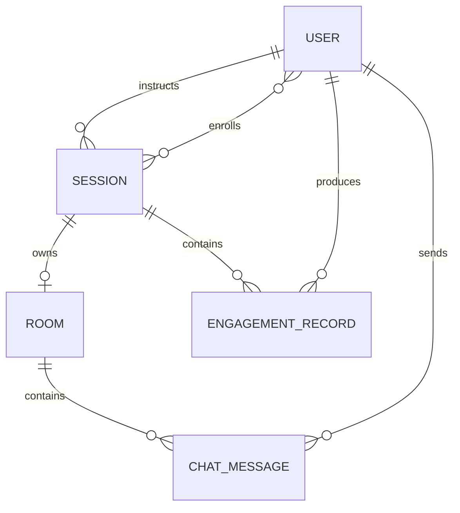

# ThirdEye Architecture

This document describes the complete ThirdEye system from the client repository's perspective. The application is split across independent client and server repositories.

## System context



## Responsibilities

### Client

The React client renders role-specific screens, captures local media, maintains a WebRTC connection per remote participant, performs engagement inference, and combines REST data with live Socket.IO state. Axios sends credentials with every API request and redirects unauthenticated users to `/login`.

### Server

Express owns durable business operations: authentication, session lifecycle, room validation, enrollment, engagement storage, analytics, chat history, and administration. Socket.IO relays WebRTC signaling and live classroom events. MongoDB stores users, sessions, rooms, messages, and engagement records.

### Browser peers

Each browser creates a direct WebRTC connection to every other participant. This is a mesh topology: signaling goes through Socket.IO, while media flows directly between browsers. Mesh bandwidth and CPU costs grow with room size.

## Authentication and API flow

```mermaid
sequenceDiagram
    participant B as Browser
    participant A as Express API
    participant D as MongoDB

    B->>A: POST /api/auth/login
    A->>D: Find user and verify bcrypt hash
    D-->>A: User
    A-->>B: User + JWT; set httpOnly cookie
    B->>A: Authenticated REST request
    Note over B,A: Cookie is sent with credentials; client may also send Bearer token
    A->>A: Verify JWT and role
    A->>D: Read or mutate data
    D-->>A: Result
    A-->>B: JSON response
```

In production, the authentication cookie is `Secure`, `SameSite=None`, and httpOnly. In development it uses `SameSite=Lax`. Protected REST routes verify the cookie or authorization header through authentication middleware.

## Session lifecycle

1. An instructor creates a `scheduled` session.
2. Students browse and enroll; joining a live Socket.IO room also auto-enrolls non-instructors.
3. The owning instructor starts the session. The server generates a code such as `ABC-XYZ-123`, marks the session `active`, and creates its one-to-one `Room`.
4. Participants validate the code through REST, acquire local media, and join the Socket.IO room.
5. The instructor ends the session through REST and emits `end-session`. The server marks durable state `completed`, records end times, notifies connected peers, and clears in-memory state.

## WebRTC signaling



The server treats SDP and ICE candidates as opaque payloads. Participant and permission state is stored in server memory. Multiple server instances therefore require a shared Socket.IO adapter and shared room-state store, typically Redis. TURN servers should be added for reliable production connectivity.

## Engagement processing



Only students run monitoring. MediaPipe's model and WASM runtime load from external CDNs, but inference remains in the browser. The score uses eye openness, gaze, head yaw, face centering, and face size. The latest label is emitted over Socket.IO every two seconds for the instructor's live view.

To reduce storage, `very_high` samples are not persisted. Other labels, confidence, model name, and derived face statistics are posted to the authenticated REST endpoint. Historical analytics use last observation carried forward (LOCF) to interpret missing intervals. A missing record therefore does not necessarily mean missing monitoring.

## Persistence model



- `User`: identity, bcrypt password hash, role, and avatar color.
- `Session`: instructor, enrolled students, schedule, duration, lifecycle status, and room code.
- `Room`: one-to-one active-room metadata and end time.
- `ChatMessage`: room, sender, denormalized sender name, content, and timestamp.
- `EngagementRecord`: session, student, label, confidence, model, face statistics, and timestamp.

## Operational boundaries

- MongoDB is the durable source of truth; live peer and permission state is ephemeral.
- The server is both the REST endpoint and Socket.IO endpoint on one HTTP server.
- CORS accepts only `CLIENT_URL`; client and server deployment values must match exactly.
- Swagger UI is exposed at `/api/docs` only outside production.
- Current Socket.IO handlers do not authenticate the connection or independently verify instructor-only events. Production hardening should derive identity and authorization from a verified socket handshake rather than event payloads.
- Chat sender identity is currently supplied by the client. It should be derived from authenticated socket state in a hardened deployment.

